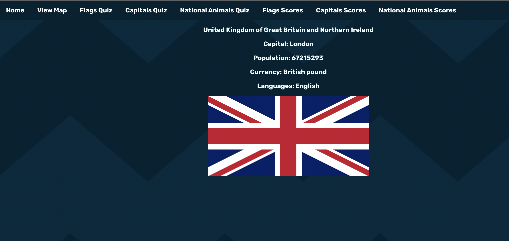

# Countries Educational Project

The task:

>The BBC are looking to improve their online offering of educational content by developing some interactive browser applications that display information in a fun and interesting way. Your task is to make an a Minimum Viable Product or prototype to put forward to them - this may only be for a small set of information, and may only showcase some of the features to be included in the final app.

**MVP**

User should be able to:
* view some educational content on a particular topic
* be able to interact with the page to move through different sections of content

**Extensions**

* Use an API to bring in content or a database to store information
* Use charts or maps to display your information to the page

Homepage: 

View Map:

Choose Country:

View Chosen Country Info:

Flags Quiz:

Round Result and Submit Score Form:

Scores Board for Flags, similar for Capitals and National Animals Quizzes:

Capitals Quiz:

National Animals Quiz:

National Animals Quiz Choose Answer:

